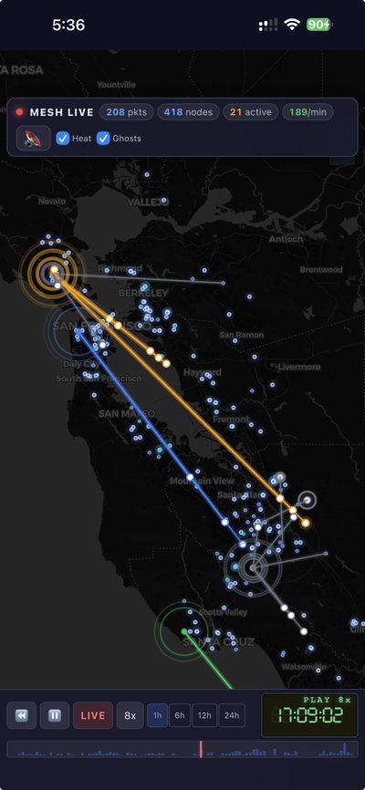
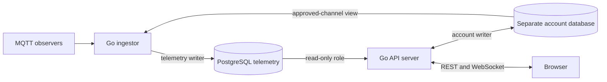

# CoreScope

[](https://github.com/Kpa-clawbot/CoreScope/actions/workflows/deploy.yml)
[](https://github.com/Kpa-clawbot/CoreScope/actions/workflows/deploy.yml)
[](https://github.com/Kpa-clawbot/CoreScope/actions/workflows/deploy.yml)
[](https://github.com/Kpa-clawbot/CoreScope/actions/workflows/deploy.yml)
[](https://github.com/Kpa-clawbot/CoreScope/actions/workflows/deploy.yml)

> MeshCore packet analysis with a Go backend, PostgreSQL persistence, real-time WebSocket updates and channel decryption.

Self-hosted, open-source MeshCore packet analyzer. Collects MeshCore packets via MQTT, decodes them in real time, and presents a full web UI with live packet feed, interactive maps, channel chat, packet tracing, and per-node analytics.

## ⚡ Performance

The Go backend combines a packet cache with PostgreSQL persistence and SQL-backed analytics. The ingestor owns telemetry writes; the server uses a restricted telemetry reader and a separate optional account writer. Existing SQLite instances require the [offline PostgreSQL upgrade](docs/postgresql-upgrade.md).

Budget for the application and PostgreSQL together, including retained data, indexes, WAL and the packet cache. Historical SQLite measurements in [PERFORMANCE.md](PERFORMANCE.md) are baseline context, not PostgreSQL results. Use the [paired benchmark workflow](.github/workflows/postgres-benchmark.yml) for an exact candidate comparison.

## ✨ Features

### 📡 Live Trace Map
Real-time animated map with packet route visualization, VCR-style playback controls, and a retro LCD clock. Replay the last 24 hours of mesh activity, scrub through the timeline, or watch packets flow live at up to 4× speed.


### 📦 Packet Feed
Filterable real-time packet stream with byte-level breakdown, Excel-like resizable columns, and a detail pane. Toggle "My Nodes" to focus on your mesh.


### 🗺️ Network Overview
At-a-glance mesh stats — node counts, packet volume, observer coverage.


### 📊 Node Analytics
Per-node deep dive with interactive charts: activity timeline, packet type breakdown, SNR distribution, hop count analysis, peer network graph, and hourly heatmap.


### 💬 Channel Chat
Decoded group messages with sender names, @mentions, timestamps — like reading a Discord channel for your mesh.


### 📱 Mobile Ready
Full experience on your phone — proper touch controls, iOS safe area support, and a compact VCR bar.



### And More

- **11 Analytics Tabs** — RF, topology, channels, hash stats, distance, route patterns, and more
- **Node Directory** — searchable list with role tabs, detail panel, QR codes, advert timeline
- **Packet Tracing** — follow individual packets across observers with SNR/RSSI timeline
- **Observer Status** — health monitoring, packet counts, uptime, per-observer analytics
- **Hash Collision Matrix** — detect address collisions across the mesh
- **Channel Key Auto-Derivation** — hashtag channels (`#channel`) keys derived via SHA256
- **Multi-Broker MQTT** — connect to multiple brokers with per-source IATA filtering
- **Dark / Light Mode** — auto-detects system preference, map tiles swap too
- **Theme Customizer** — design your theme in-browser, export as `theme.json`
- **Global Search** — search packets, nodes, and channels (Ctrl+K)
- **Shareable URLs** — deep links to packets, channels, and observer detail pages
- **Protobuf API Contract** — typed API definitions in `proto/`
- **Accessible** — ARIA patterns, keyboard navigation, screen reader support

## Quick Start

### Pre-built image with PostgreSQL

Retain the complete repository at the same reviewed revision as the image. The Compose variants require the common PostgreSQL service and initialization scripts.

```bash
git clone https://github.com/Kpa-clawbot/CoreScope.git
cd CoreScope
git checkout --detach "$CORESCOPE_REF"
cp .env.example .env
chmod 600 .env
# Fill each PostgreSQL password field with a different openssl rand -hex 32 value.
# Set CORESCOPE_IMAGE to the matching reviewed image tag or digest.
docker compose -f docker-compose.example.yml up -d
```

Open `http://localhost`. Bootstrap creates separate telemetry and account databases and grants restricted runtime roles before the application starts. Existing SQLite data requires the [offline upgrade](docs/postgresql-upgrade.md) first. See [DEPLOY.md](DEPLOY.md) for ports, MQTT, HTTPS and native backups.

### Build from source

Use the same complete checkout and private `.env`, then run `./manage.sh setup`. The wizard configures, builds and starts the source deployment. PostgreSQL credentials must already be filled in.

```bash
./manage.sh status
./manage.sh logs
./manage.sh backup ./backups/instance
./manage.sh update
```

### Configure

Copy `config.example.json` to `config.json` and edit:

```json
{
  "port": 3000,
  "mqtt": {
    "broker": "mqtt://localhost:1883",
    "topic": "meshcore/+/+/packets"
  },
  "mqttSources": [
    {
      "name": "remote-feed",
      "broker": "mqtts://remote-broker:8883",
      "topics": ["meshcore/+/+/packets"],
      "username": "user",
      "password": "pass",
      "iataFilter": ["SJC", "SFO", "OAK"]
    }
  ],
  "channelKeys": {
    "public": "8b3387e9c5cdea6ac9e5edbaa115cd72"
  },
  "defaultRegion": "SJC"
}
```

| Field | Description |
|-------|-------------|
| `port` | HTTP server port (default: 3000) |
| `mqtt.broker` | Local MQTT broker URL (`""` to disable) |
| `mqttSources` | External MQTT broker connections (optional) |
| `channelKeys` | Channel decryption keys (hex). Hashtag channels auto-derived via SHA256 |
| `defaultRegion` | Default IATA region code for the UI |
| `databaseURL` | PostgreSQL telemetry URL; prefer the per-process environment credentials below |
| `stateDir` | Filesystem directory for queues, statistics and account backups (default: `data`) |

### Environment Variables

| Variable | Description |
|----------|-------------|
| `PORT` | Override config port |
| `CORESCOPE_READER_DATABASE_URL` | Server telemetry reader URL |
| `CORESCOPE_WRITER_DATABASE_URL` | Ingestor telemetry writer URL |
| `CORESCOPE_USERS_DATABASE_URL` | Optional account writer URL in a separate database |
| `CORESCOPE_APPROVED_CHANNELS_DATABASE_URL` | Ingestor's restricted approved-channel reader URL |
| `CORESCOPE_STATE_DIR` | Shared state-directory path; never a database URL |

## Architecture



**Two-process model:** The ingestor handles MQTT, decoding, telemetry writes and retention. The HTTP server loads its packet cache and serves REST/WebSocket requests using a read-only telemetry role. Accounts use a separate PostgreSQL database and writer role. Supervisord runs the application processes with Caddy and optional Mosquitto; PostgreSQL runs as a separate service. Bootstrap/import credentials are not runtime credentials.

## MQTT Setup

1. **Flash an observer node** with `MESH_PACKET_LOGGING=1` build flag
2. **Connect via USB** to a host running [meshcoretomqtt](https://github.com/Cisien/meshcoretomqtt)
3. **Configure meshcoretomqtt** with your IATA region code and MQTT broker address
4. **Packets appear** on topic `meshcore/{IATA}/{PUBKEY}/packets`

Or POST raw hex packets to `POST /api/packets` for manual injection.

## Project Structure

```
corescope/
├── cmd/
│   ├── server/              # Go HTTP server + WebSocket + REST API
│   │   ├── main.go          # Entry point
│   │   ├── routes.go        # 40+ API endpoint handlers
│   │   ├── store.go         # In-memory packet store (5 indexes)
│   │   ├── db.go            # Read-only PostgreSQL access
│   │   ├── decoder.go       # MeshCore packet decoder
│   │   ├── websocket.go     # WebSocket broadcast
│   │   └── *_test.go        # Server tests
│   └── ingestor/            # Go MQTT ingestor
│       ├── main.go          # MQTT subscription + packet processing
│       ├── decoder.go       # Packet decoder (shared logic)
│       ├── db.go            # PostgreSQL writer and retention path
│       └── *_test.go        # Ingestor tests
├── proto/                   # Protobuf API definitions
├── public/                  # Vanilla JS frontend (no build step)
│   ├── index.html           # SPA shell
│   ├── app.js               # Router, WebSocket, utilities
│   ├── packets.js           # Packet feed + hex breakdown
│   ├── map.js               # Leaflet map + route visualization
│   ├── live.js              # Live trace + VCR playback
│   ├── channels.js          # Channel chat
│   ├── nodes.js             # Node directory + detail views
│   ├── analytics.js         # 11-tab analytics dashboard
│   └── style.css            # CSS variable theming (light/dark)
├── docker/
│   ├── supervisord-go.conf  # Process manager (server + ingestor)
│   ├── mosquitto.conf       # MQTT broker config
│   ├── Caddyfile            # Reverse proxy + HTTPS
│   └── entrypoint-go.sh     # Container entrypoint
├── Dockerfile               # Multi-stage Go build + Alpine runtime
├── config.example.json      # Example configuration
├── tests/                   # Node.js test suite: unit/ (test-all.sh) and e2e/ (Playwright)
├── test-all.sh              # Runs every suite in tests/unit
└── tools/                   # Generators, E2E tests, utilities
```

## For Developers

### Building

```bash
make build        # all four binaries for your machine, into dist/
make build-server # just one
make crossbuild   # static linux/amd64 + linux/arm64 binaries
```

Runtime database access uses pgx through `database/sql`. The offline importer retains
the cgo [`mattn/go-sqlite3`](https://github.com/mattn/go-sqlite3) driver for legacy
sources, so cross-compiling that binary needs a C compiler. `make crossbuild` uses
[`zig`](https://ziglang.org/download/) as that compiler (install it and it just
works) and links statically against musl, so the result is one self-contained file
that runs on Alpine or scratch. The container build does the same thing — see
`Dockerfile`.

### Test Suite

Go suites exercise real PostgreSQL, role boundaries, concurrency, migration and native backup/restore. The standalone frontend list remains `test-all.sh`; Playwright covers the imported fixture and accounts on/off. CI pins Go 1.27.2 and PostgreSQL 18.6.

```bash
# Point this at an isolated PostgreSQL 18 administrator database.
# Keep the URL in private environment configuration; pg_dump/pg_restore 18 must be on PATH.
# CORESCOPE_TEST_POSTGRES_URL is required; database tests do not silently skip.
# Go backend tests
cd cmd/server && go test ./... -v
cd cmd/ingestor && go test ./... -v

# Or across all modules
make test

# Node.js frontend + integration tests
npm test

# Playwright E2E (requires running server on localhost:3000)
node tests/e2e/test-e2e-playwright.js
```

### Generate Test Data

```bash
node tools/generate-packets.js --api --count 200
```

### Migrating from Node.js

Historical Node.js/SQLite deployments must first reach a supported SQLite layout using the last SQLite release, then follow the [offline PostgreSQL upgrade](docs/postgresql-upgrade.md). Preserve the original data, configuration and keys; a container/image update alone does not perform this conversion.

## Contributing

Contributions welcome. Please read [AGENTS.md](AGENTS.md) for coding conventions, testing requirements, and engineering principles before submitting a PR.

**Live instance:** [analyzer.00id.net](https://analyzer.00id.net) — all API endpoints are public, no auth required.

**API Documentation:** CoreScope auto-generates an OpenAPI 3.0 spec. Browse the interactive Swagger UI at [`/api/docs`](https://analyzer.00id.net/api/docs) or fetch the machine-readable spec at [`/api/spec`](https://analyzer.00id.net/api/spec).

## License

GPL-3.0-or-later
